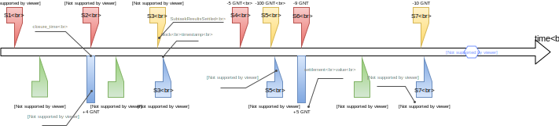

Concent Settlement Algorithm
############################
This document describes the algorithm used by Concent in the "forced payment" use case (UC5) to determine the unpaid balance between the provider and the requestor.

Payments between the requestor and the provider
===============================================
.. image:: diagrams/concent-settlement-algorithm/payments-requestor-provider.svg

The obligation to pay arises when the requestor accepts subtask results submitted by the provider.
The proof of that acceptance is a `SubtaskResultsAccepted` message signed by the requestor.

An acceptance should be followed by a payment in GNT from requestor's Ethereum account to provider's account.
The payment is due not later than `PDT` after the acceptance.
The time of the acceptance is indicated by the `payment_ts` timestamp included in the message.
`PDT` (`PAYMENT_DUE_TIME`) is a protocol constant.

Payment is not associated with a specific subtask.
It's a lump sum that covers the cost of all subtasks accepted before the `closure_time` indicated in the transaction.
All the acceptances preceding the `closure_time` become overdue immediately if the sum is not large enough to cover them.

A regular payment is done by the requestor as a *batch transfer*.
A single batch transfer may transfer GNT to multiple Ethereum accounts, possibly belonging to different providers.

Forced payments
===============
Concent provides a voluntary deposit mechanism and can transfer funds from a deposit to an Ethereum account if the owner of the account can prove that he has not received full compensation for work performed in the Golem network.

There are two kinds of transfers from the deposit that Concent can perform:
1. *Forced subtask payment*
2. *Forced payment*

To avoid confusion, we'll refer to forced payments as *settlement payments*.
All direct payments that do not involve deposits will be referred to as *regular payments*.

Forced subtask payment
~~~~~~~~~~~~~~~~~~~~~~
A forced subtask payment covers the cost of a single subtask.
It's published on the blockchain with the ID of that subtask instead of `closure_time`.

Concent performs a *forced subtask payment*:

- In the "forced acceptance" use case (UC3): if the requestor does not submit any response (neither acceptance nor rejection).
  If the requestor submits an acceptance, he's responsible for covering it with a regular payment on his own.
- In the "additional verification" use case (UC4): if the requestor has decided to reject the results but Concent determines that the results are valid.

In all cases Concent is responsible for issuing both the acceptance and the payment.
Payment is published immediately but a delay due to external factors is always possible (failure to connect to an Ethereum node, spike in transaction fees, etc.).

The payment amount is always lower or equal to the cost of the subtask it's meant to cover.
If the requestor does not have enough free funds in his deposit at the time, Concent decreases the amount to satisfy provider's claim at least partially.
The missing amount may be reclaimed later in the "forced payment" use case if the requestor replenishes his deposit.

Settlement payment
~~~~~~~~~~~~~~~~~~
A settlement payment is the payment type used to settle all overdue payments in the "forced payment" use case.

Just like in case of a forced subtask payment, Concent may decrease the settlement amount if requestor's deposit is not big enough to cover it in full.

The decision is always final - all subtasks accepted before such a payment are considered settled and Concent will refuse to consider any future settlement requests that include them.

Settlement request
==================

The settlement starts with provider submitting his request to Concent.
The request must contain the oldest known acceptance for which payment is overdue or incomplete and all the acceptances that follow it even if some of them are covered by regular or forced payments.
The provider might not be compensated in full if some acceptances are omitted and it's not possible to submit them later.

If the acceptances meet any of the conditions listed in the table below, Concent immediately responds with an error message and the settlement is not performed:

==== =============================================================================================================== ======================== ===========================
No   Condition                                                                                                       Response                 Reason
==== =============================================================================================================== ======================== ===========================
1    Subtask ID present in another acceptance                                                                        `ServiceRefused`         `InvalidRequest`
2    `ForcePayment` message not signed by the provider listed in the subtask                                         `ServiceRefused`         `InvalidRequest`
3    Acceptance not signed by the requestor of the subtask nor Concent                                               `ServiceRefused`         `InvalidRequest`
4    Subtask from a different requestor than in other acceptances                                                    `ServiceRefused`         `InvalidRequest`
5    Subtask for a different provider than in other acceptances                                                      `ServiceRefused`         `InvalidRequest`
6    Payment from a different Ethereum account than listed in the subtask                                            `ServiceRefused`         `InvalidRequest`
7    Payment to a different Ethereum account than listed in the subtask                                              `ServiceRefused`         `InvalidRequest`
8    `payment_ts` <= `closure_time` of the last settlement payment                                                   `ForcePaymentRejected`   `TimestampError`
9    `payment_ts` > `timestamp` of the message                                                                       `ForcePaymentRejected`   `TimestampError`
10   `payment_ts` > current time (according to Concent's clock)                                                      `ForcePaymentRejected`   `TimestampError`
11   `payment_ts >= max(current time - PDT, closure_time of most recent payment)` (according to Concent's clock)     `ForcePaymentRejected`   `TimestampError`
12   Requestor has no deposit                                                                                        `ServiceRefused`         `TooSmallRequestorDeposit`
13   Requestor has deposit but the whole amount is already claimed in other ongoing use cases                        `ServiceRefused`         `TooSmallRequestorDeposit`
==== =============================================================================================================== ======================== ===========================

The provider is allowed to submit earlier acceptances for subtasks that have already been paid for as long as none of them predates the most recent settlement payment.
Concent will notice that they've been paid for and they'll be canceled out by the matching payments present on the blockchain.
There's however no advantage for the provider in doing this.
It might affect the settlement in requestor's favor if he earlier did something against his own interest (e.g. if his earlier payment was too large) by making some amount that would otherwise be ignored actually count.

Settlement involving multiple Ethereum accounts or multiple provider-requestor pairs is not possible in a single operation but the provider may request as many separate settlements as necessary.

Settlement calculation
======================
.. image:: diagrams/concent-settlement-algorithm/settlement-calculation.svg

To calculate the settlement amount Concent first prepares several lists and timestamps:

- `LAR` - list of all acceptances submitted by the provider
- `T0` - timestamp of the oldest acceptance from `LAR`
- `T2` - timestamp of the youngest acceptance from `LAR`
- `LT` - list of all regular payments younger or equal to `T0`
- `LF` - list of all forced subtask payments younger or equal to `T0` for which the corresponding acceptance is present in `LAR`
- `T1` - timestamp of the oldest payment from `LT`

Then it calculates the total cost of all subtasks from `LAR` and the sums of payments found in `LT` and `LF`.

The raw settlement amount `V` is the difference between the subtask cost and the total amount paid by the requestor:

.. code::

   V = max(0, sum(LAR) - sum(LT) - sum(LF))

If `V` is zero, Concent sends `ForcePaymentRejected` (reason: `NoUnsettledTasksFound`) to the provider.
No payment is performed.

Otherwise, Concent computes the final settlement amount `V'` that takes into account the amount of funds actually available in requestor's deposit and not claimed in other use cases (`D`):

.. code::

   V' = min(V, D)

Concent immediately issues a settlement payment for the amount `V'` and sends `ForcePaymentCommitted` to the provider.
Requestor receives the same `ForcePaymentCommitted` out of band.
The `closure_time` is `T2` which is the `payment_ts` timestamp of the youngest submitted acceptance.

`LAU` and `LAO` lists
~~~~~~~~~~~~~~~~~~~~~
`LAR` can be further subdivided into:

- `LAU` - list of all acceptances from `LAR` older than or equal to `T1` (i.e. the youngest payment from `LT`)
- `LAO` - list of all acceptances from `LAR` younger than `T1`.

The distinction is just another way to express condition 11 from the previous section.
`LAU` is the list of those acceptances that are already covered by an existing payment.
If the payment is not high enough to cover their cost they are automatically considered overdue and can be submitted to Concent even while still within `PDT`.
`LAO` contains the remaining acceptances for which `PDT` must be enforced.

Deposit changes during the settlement
~~~~~~~~~~~~~~~~~~~~~~~~~~~~~~~~~~~~~
There are two factors that may decrease the amount of deposit available during the settlement:

1. Another client reserving a part of requestor's deposit in UC3, UC4 or even another UC5 running in parallel.
2. Requestor paying out his deposit

Either can occur during the calculation or while the blockchain transaction is still waiting to be published after it.

To deal with the first possibility during the calculation, the settlement algorithm is executed inside a critical section with a mutex guarding against any changes to the amount of reserved deposit.
All the Concent processes running in parallel must wait for the settlement to finish before creating a new claim against the deposit belonging to the same requestor.
Before exiting the critical section Concent reserves the final amount of deposit to lock it until the pending blockchain transaction goes through.

The second possibility is out of Concent's control.
While Concent could monitor deposit payouts and detect when a decrease is about to happen, a withdrawal cannot be canceled anyway.
It could refuse settlement but that does not help the provider in any way.
It could decrease the final settlement amount but this adds complexity and also may lead to provider getting less than he could otherwise.
The simplest option is to try and allow the provider to retry the settlement if it fails.

The deposit size is checked only once during the prerequisite condition checks and Concent won't notice a change after that point in the settlement.
If the requestor manages to decrease his deposit after the start of the settlement but before the payment goes through, the settlement payment may fail.
This will result in the settlement not being recorded on the blockchain, allowing the provider to start the settlement again.
Note that the failure is going to occur only after `ForcePaymentCommitted` has already been sent to the client.
It's recommended for the client to verify that the settlement transaction is actually on the blockchain before discarding the corresponding acceptances and assuming that the payment was successful.

Blockchain and the timeline
===========================
It is very important to realize that the point on the timeline where a payment is placed (`closure_time`) is not the same as the time it appeared on the blockchain.
New blocks are published continuously and each one may add new events to the timeline but at that point they're usually already in the past.
They may be placed at an earlier point in time intentionally (as is always the case with settlement payments) or due to the fact that the process of making a transaction, having it included a block propagated to the whole network and confirmed by subsequent blocks is not instant.

The following diagram shows blocks published as the time goes on and placed where they'll be seen on the timeline:

On the diagram the horizontal position of the center of each block corresponds to its timestamp (the yellow line shows this directly for selected blocks).
Note that while the average time between blocks is constant, the intervals between individual blocks are quite irregular.

A few most recent blocks are always considered unconfirmed and not taken into account.
On the diagram the required number of confirmations is depicted as 3 for simplicity but that's very low and in practice it should be higher.

Here's how the payment timestamps relate to the block timestamps:

- `closure_time` in regular payments will usually be pretty close to the timestamp of its block.
  The contract validates that it's not in the future, while putting it in the past is against requestor's interest as it can only decrease the range of acceptances it might cover.
- `closure_time` in settlement payments will usually be significantly earlier than the block timestamp because Concent sets it to the time of the youngest accepance submitted by the provider.
  It's validated by a contract as well and cannot be in the future.
  In many cases it will be at least `PDT` from current time but due to the fact that acceptances become overdue immediately if they're followed by an insufficient payment, it can be arbitrarily close to the current time.
- Forced subtask payments do not have `closure_time` so we place them at the point corresponding to their block timestamp instead.
  Their position on the timeline does not really matter except in rare corner cases.

Accuracy of block timestamps
~~~~~~~~~~~~~~~~~~~~~~~~~~~~
The point marked as "now" on the diagram above shows the time (according to the local clock) when this state has been observed.
Note that there's quite a large gap between block `23` and "now".
This is because block timestamps do not represent the time the block was received.
So what do they really represent?

The timestamp in a block is defined by the miner who creates and publishes it.
The miner sets it when he creates the block - which is as soon as he notices that a new block has been published, in order to maximize the time spent mining.
The timestamp, once set, is unlikely to be updated as time goes on during the mining process because code in the transactions may refer to the timestamp and changing it would require reexecuting them.

Thus the timestamp of a block can be expected to be close to the time when the miner has received the **previous block** which is the reason for the systematic bias.

In addition to this shift, the timestamp can be affected by miner's clock being out of sync or miner's deliberate attempt to manipulate it.
There are several mechanisms that limit scope of such discrepancies:

1. Timestamp resolution is 1 second.
2. An Ethereum block is considered valid only if its timestamp is later than the timestamp of its parent block.

  - There's currently no upper limit on how far timestamps in two subsequent blocks can be (it used to be 900 seconds in the past).

3. Many Ethereum nodes will ignore a block as long as its timestamp is in the future according to their local clock.
4. Many implementations refuse to connect to other Ethereum nodes when the time difference is too large.
5. Many computers are configured to synchronize their time with an authoritative time source.

All of these factors taken together seem to be enough to keep overall block times close to actual time but the timestamp of any given block can end up a little skewed in either direction.
The timestamp represents "now" as seen from within the code executed by a transaction but cannot be reliably interpreted as the time of block creation or publication with high precision.

From the perspective of the settlement algorithm this lack of accuracy is not a significant problem.
The only way in which the algorithm relies on block timestamps is as a hint to determine the range of blocks that may contain payment transactions relevant to the settlement and avoid having to search the whole blockchain.

- In case of regular and settlement payments `closure_time` is validated by the contract and cannot be in the future.
  For the contract "future" is relative to the block timestamp rather than the clock of any particular machine in the network which means that we can be sure that `closure_time` can never be later than the timestamp, no matter how unreliable the timestamp is.
  Thanks to this we know that we can safely ignore any blocks with timestamps older than the `closure_time` we're looking for.
- In case of forced subtask payments the payment is paired with the subtask it pays for by ID and in general it's impossible to find the right ID by looking only at block timestamps.
  Fortunately we can make additional assumptions: in UC3 and UC4 Concent always makes a forced subtask payment immediately after issuing an acceptance.
  Due to inherent delays the payment will always end up in a block published after `payment_ts` from the acceptance but as stated above, the timestamp may still end up being earlier.
  Since block timestamp can be used as a very rough approximation of the block publication time, when searching for the payment, we're safe if we ignore all blocks before `payment_ts` except for the few most recent ones within a reasonable safety margin.

Settlement example
~~~~~~~~~~~~~~~~~~
The four diagrams below show on a concrete example of how Concent interprets blockchain state and data submitted by the provider during a settlement.

Settlement 1
------------
.. image:: diagrams/concent-settlement-algorithm/settlement-example-1.svg

The diagram above shows the state during the first settlement:

- The requestor has made three payments but Concent will consider only payment `B`:
  
  - Payment `A` paid for `S1` and `S2`.
    Concent won't take it into account it because it was made before the earliest submitted acceptance (`S3`).
  - Payment `C` should be taken into account based on its `closure_time`, but the block it's included in does not have enough confirmations yet.
    Concent ignores blocks that don't have the minimum required number of confirmations because of the risk that they could end up in a short-lived side-chain.
- The provider has submitted three out of six acceptances in his possession.
  As for the other three:

  - `S1` and `S2` were properly paid for so there's no need to submit them.
  - `S6` is not overdue yet and cannot be submitted (still within `PDT` and not yet followed by a payment since `C` does not count).

The submitted acceptances do not violate any of the prerequisite conditions so Concent accepts the request.
The provider can prove that he performed work that cost 29 GNT in total while the requestor has paid only 19 GNT.
Concent makes a settlement payment for the missing 10 GNT and sets its `closure_time` to `T2`.

Settlement 2
------------
.. image:: diagrams/concent-settlement-algorithm/settlement-example-2.svg

This diagram shows the status of the same provider-requestor pair after some time has passed.
The provider once again asks Concent to settle overdue payments.

The settlement payment `Z` issued in settlement 1 is now visible on the blockchain.
Note that it took a few blocks before it came into effect - the most recent block during settlement 1 was block `15` and `Z` was only included in block `18`.
Moreover the block containing `Z` did not have enough confirmations until block `21` was mined.

Note also that blocks `14` and `15` became orphaned and blockchain now contains `14'` and `15'` in their place (with slightly different timestamps).
This is a common occurrence for blocks that have very few confirmations.

The transactions originally included in blocks `14` and `15` are not lost - they go back to the transaction pool and miners are very likely to include them in subsequent blocks.
In fact, most of them are likely already present in `14'` and `15'`.
You can see that the regular payment `C` originally included in block `15` was not as lucky but eventually it found its way into block `17`.

The provider has completed four additional subtasks (`S7`, `S8`, `S9`, `S10`).
The requestor has rejected the results of the first two but Concent has accepted them in additional verification and covered them with forced subtask payments.

There's also `S6`, which was not paid for in full.

The pink and yellow blocks on the diagram show where Concent looks for payments relevant to the settlement:

- The yellow blocks have timestamps later than `T0`.
  They are the only ones that may contain regular payments with `closure_time >= T0`.
  They may also contain forced subtask payments covering the submitted acceptances.
- The pink blocks are the blocks with timestamps close to `T0` that are within the a small safety margin and are searched for forced subtask payments too.

Again no prerequisite conditions for the settlement are violated.
Even though payment `Z` was published in a block with timestamp later than T0 it does not violate condition 8 since it's the `closure_time`, not block timestamp that's relevant.

The result of the settlement is a settlement payment for 32 GNT.

Settlement 3
------------
.. image:: diagrams/concent-settlement-algorithm/settlement-example-3.svg

In this settlement the provider thinks that he did not receive payment for subtasks `S9`, `S10`, `S11` and `S12`.
We can see that the payment `D` covers all of them but it came very late.
It has barely received enough confirmations for Concent to take it into account - it's entirely possible for a new payment to become visible in between checks made by the client and Concent.
It's also possible for the client to ignore recent blocks due to a higher required number of confirmations.

One thing of note here is that Concent ignores forced subtask payment for `S8` even though it was published in one of the pink blocks.
That's because no acceptance with matching subtask ID was submitted by the provider.

Concent can see that all the outstanding acceptances were paid for and refuses the settlement by responding with `ForcePaymentRejected`.
No settlement payment is issued.

Settlement 4
------------
.. image:: diagrams/concent-settlement-algorithm/settlement-example-4.svg

The provider asks for a settlement again.
The only difference from settlement 3 is `S13` which is now overdue and can be submitted to Concent.

Since `S9`, `S10`, `S11` or `S12` clearly have been paid for, there's no reason to submit them again and it's better for the client to omit them but submitting them is not prohibited.

This time the settlement ends with a settlement payment for 100 GNT.

Analysis of typical cases
=========================
This section provides a comprehensive set of examples to clarify how the settlement value should be computed in both common and not so common cases.

Common cases
~~~~~~~~~~~~
.. image:: diagrams/concent-settlement-algorithm/cases-common.svg

- **CC1**) Settlement payment that did not cover the whole amount.

  *A settlement payment settles everything before it.*
  *Concent ignores the missing amount.*

- **CC2**) Regular payment before the first submitted acceptance.

  *The payment is not taken into account.*

  This case may happen for various reasons:

  - Normal situation: there was an acceptance before the payment but the provider decided not to submit it (he knows it was fully paid for, he lost it, etc.).
  - Normal situation: during the last settlement, there were regular payments after the last submitted acceptance.
  - Unlikely situation: requestor set `closure_time` to a value earlier than `payment_ts` when paying for the subtask he has accepted.
    This is completely within requestor's control and making such a payment is against his best interest.
  - Unlikely situation: requestor issued a rejection but then issued an acceptance and paid for the subtask.
    Again, this is something a requestor absolutely should not do.
    A malicious provider could use the rejection to initiate additional verification and get another acceptance with a timestamp more recent than payment's `closure_time`.

- **CC3**) Forced subtask payment before the first submitted acceptance.

  *Normal and expected situation.*
  *The payment is not taken into account.*

  This applies only to a situation where the payment follows the acceptance with a matching subtask ID.
  In the rare case where the payment precedes the acceptance, Concent takes it into account if the time difference is still within a predefined safety margin.

  This case may happen for various reasons:

  - Normal situation: the provider did not submit the corresponding acceptance which happened to be the earliest one in `LAR`.
  - Normal situation: during the last settlement, there were forced subtask payments after the last submitted acceptance.

- **CC4**) Subtask without payment.

  *Concent includes subtask cost in the settlement amount.*

- **CC5**) Regular payment that covers the subtask in full.

  *Normal and expected situation.*
  *Does not change the settlement amount.*

- **CC6**) Regular payment that's too low.

  *Concent adds the missing value to the settlement amount.*

- **CC7**) Regular payment that's too high.

  *Concent subtracts the extra value from the settlement amount.*

- **CC8**) Forced subtask payment that covers the subtask in full.

  *Normal and expected situation.*
  *Does not change the settlement amount.*

- **CC9**) Forced subtask payment that did not cover the whole cost of its subtask.

  *Concent adds the missing value to the settlement amount.*

  This is a situation that happens if the requestor does not have enough deposit at the time Concent makes a forced subtask payment.

- **CC10**) Regular payment before acceptance but after `T0`.

  *The payment does count.*
  *Does not change the settlement amount.*

  Concent does not strictly enforce `closure_time` for regular payments.
  The timestamp determines only if a payment will be considered a part of `LT` set.
  The order of payments in that set does not matter so an earlier payment can cover a subtask computed after it.

- **CC11**) Forced subtask payment for which the acceptance was not submitted by the provider.

  *Payment is not taken into account.*
  *Does not change the settlement amount.*

  If the acceptance corresponding to a forced subtask payment has not been submitted by the provider, the payment is ignored.

- **CC12**) Regular payment for which the acceptance was not submitted by the provider.

  *Payment still counts towards other subtasks.*
  *Concent subtracts the value from the settlement amount.*

  Any subtask for which the acceptance is not submitted is treated as if it did not exist.

- **CC13**) Forced subtask payment after `T1`.

  *The payment still counts*.
  *Concent subtracts the value from the settlement amount.*

  This is a normal situation and is included here to point out that there can be payments after `T1` and they must not be ignored.

Empty lists
-----------
.. image:: diagrams/concent-settlement-algorithm/cases-empty-lists.svg

- **CC14**) No regular or forced subtask payments.

  *In this case the settlement value is the total cost of all accepted subtasks.*

  This is a normal and likely case.
  When `LT` and `LF` sets are empty, `T1` can be considered equal to `T0`.

Multiple settlements
--------------------

- **CC15**) Provider did not submit the last acceptance within a set covered by a single payment.

  This is a case that involves two settlements.
  The provider has several acceptances.
  Requestor has issued a payment with `closure_time` that covers all the acceptances but the amount is too small.
  The provider does not submit the last acceptance, and Concent issues a settlement payment with `closure_time` equal to the timestamp of oldest of the earlier acceptances.

  The provider might expect that he'll be able to extract the payment for this remaining acceptance by requesting another settlement.
  Since the settlement payment predates the acceptance, Concent will allow it.
  The problem is that the provider can no longer prove that part of the payment was already counted towards the earlier acceptances because he's not allowed to submit them.
  As a result the settlement amount determined by Concent will be too low or even zero.

  Provider can avoid this by always submitting all the acceptances that follow the earliest one known to be overdue.

Abnormal cases
~~~~~~~~~~~~~~
The situations described in this section are technically possible on the blockchain but will never happen if Concent is working correctly and the clients act according to their best interest.
They're documented so that the behavior is well defined even in extremely exceptional cases such as:

- a result of a bug
- a manual intervention in an attempt to rectify negative consequences of a serious and costly bug
- malicious actions by someone who gained access to Concent's keys

.. image:: diagrams/concent-settlement-algorithm/cases-abnormal.svg

- **CC21**) Settlement payment that was too high.

  *A settlement payment settles everything before it but does not cover anything after it.*
  *Concent ignores the extra amount.*

- **CC22**) Forced subtask payment that was too high.

  *The extra value still counts towards other subtasks.*
  *Concent subtracts the value from the settlement amount.*

- **CC23**) Forced subtask payment that precedes the acceptance of its subtask.

  *The payment still counts if Concent is able to find it.*
  *Concent subtracts the value from the settlement amount.*

- **CC24**) Multiple forced subtask payments for the same subtask.

  *All the payments count.*
  *Concent subtracts the total value of all the payments from the settlement amount.*

- **CC25**) Forced subtask payment for a subtask that does not exist.

  *The payment does not count.*
  *Does not change the settlement amount.*

  Concent cannot track all the subtasks in the network and only considers the ones for which acceptances were submitted.
  This case is indistinguishable from the provider simply not submitting the corresponding acceptance (CC11).

- **CC26**) Forced subtask payment for a subtask that the requestor has already paid for.

  *Both the regular payment and the forced subtask payment count.*
  *Concent subtracts the value of both from the settlement amount.*

Block timing issues
~~~~~~~~~~~~~~~~~~~

- **CC31**) Regular payment with `closure_time` predating `closure_time` of a settlement payment published after that payment.

  *Does not change the settlement amount.*

  This is treated the same way as CC2: `closure_time` is before `T0` so it's ignored.
  The only thing special about this case it that it may retroactively make it look like Concent made a settlement payment that was too large.

  This may happen if:

  - Normal situation: A payment made by requestor spends a really long time in the transaction pool before it gets included in a block.
    E.g. the transaction fee is too small.
  - Unlikely situation: Requestor acts against his best interest and issues a payment with `closure_time` far in the past.

- **CC32**) Forced subtask payment so far before the acceptance that Concent can't find it.

  *The payment is not taken into account.*
  *Does not change the settlement amount.*

  This is theoretically possible but very unlikely.
  The situation in which a payment made just after issuing an acceptance gets a block timestamp before that acceptance is in itself not very likely.
  One in which the difference is so big that it exceeds the safety margin of several extra blocks even less so.

- **CC33**) Provider does not submit an acceptance because he's not aware of a payment.

  *The payment still counts*.
  *Concent subtracts the value from the settlement amount.*

  This is a race condition between the requestor and the provider.
  It's possible for a payment to appear just after the provider checks blockchain and determines that some but not all of his acceptances are overdue.
  The payment makes those skipped acceptances overdue immediately and it's too late to submit them because the Concent is already processing a settlement.

  Basically, requestor with the right timing might be able to cause the situation from case CC15.
  Provider can decrease the likelihood of this happening by watching the unconfirmed blocks and holding off with a settlement request if there are any payments coming from the requestor.
