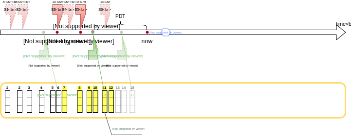
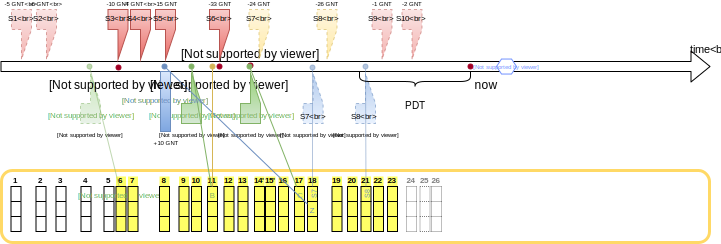
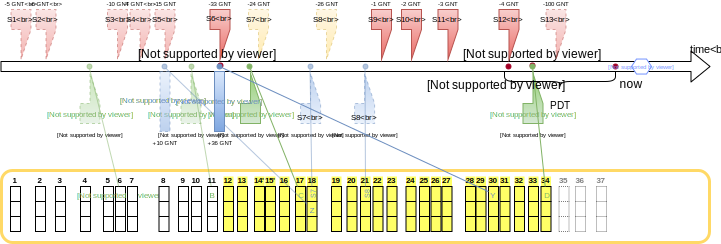
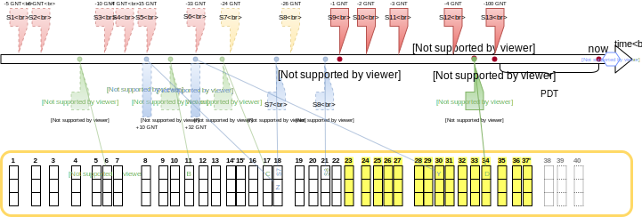
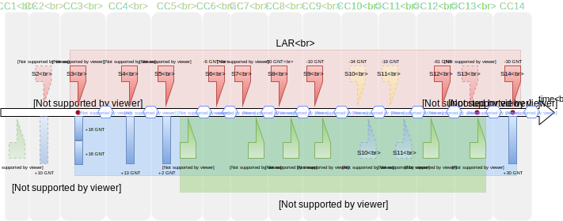
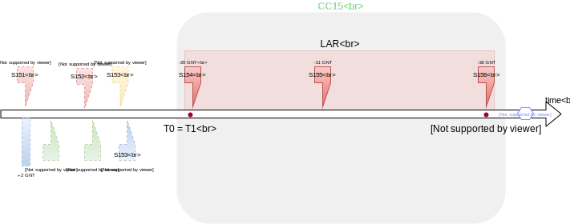
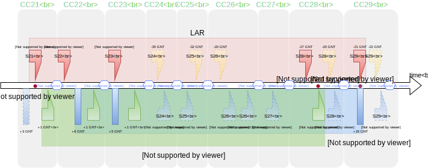

Concent Settlement Algorithm
############################
This document describes the algorithm used by Concent in the "forced payment" use case (UC5) to determine the unpaid balance between the provider and the requestor.

Payments between the requestor and the provider
===============================================

The obligation to pay arises when the requestor accepts subtask results submitted by the provider.
The proof of that acceptance is a `SubtaskResultsAccepted` message signed by the requestor.

An acceptance should be followed by a payment in GNT from requestor's Ethereum account to provider's account.
The payment is due not later than `PDT` after the acceptance.
The time of the acceptance is indicated by the `payment_ts` timestamp included in the message.
`PDT` (`PAYMENT_DUE_TIME`) is a protocol constant.

Payment is not associated with a specific subtask.
It's a lump sum that covers the cost of all subtasks accepted before the `closure_time` indicated in the transaction.
All the acceptances preceding the `closure_time` become overdue immediately if the sum is not large enough to cover them.

A regular payment is done by the requestor as a *batch transfer*.
A single batch transfer may transfer GNT to multiple Ethereum accounts, possibly belonging to different providers.

Forced payments
===============
Concent provides a voluntary deposit mechanism and can transfer funds from a deposit to an Ethereum account if the owner of the account can prove that he has not received full compensation for work performed in the Golem network.

.. image:: diagrams/concent-settlement-algorithm/regular-and-forced-payments.svg

There are three kinds of transfers from the deposit that Concent can perform:

1. *Forced subtask payment* (`ReimburseForSubtask` event on the blockchain)
2. *Forced payment* (`ReimburseForNoPayment` event on the blockchain)
3. *Additional verification payment* (`ReimburseForVerificationCosts` event on the blockchain)

To avoid confusion, we'll refer to forced payments as *settlement payments*.
All direct payments that do not involve deposits will be referred to as *regular payments*.

Settlement payments and regular payments are the only payment types taken into account by the settlement algorithm.
Forced subtask payments and verification payments are ignored.

Forced subtask payment
~~~~~~~~~~~~~~~~~~~~~~
A forced subtask payment covers the cost of a single subtask.
It's published on the blockchain with the ID of that subtask instead of `closure_time`.

Concent performs a *forced subtask payment*:

- In the "forced acceptance" use case (UC3): if the requestor does not submit any response (neither acceptance nor rejection).
  If the requestor submits an acceptance, he's responsible for covering it with a regular payment on his own.
- In the "additional verification" use case (UC4): if the requestor has decided to reject the results but Concent determines that the results are valid.

The payment amount is always lower or equal to the cost of the subtask it's meant to cover.
If the requestor does not have enough free funds in his deposit at the time, Concent decreases the amount to satisfy provider's claim at least partially.

Concent does not issue an acceptance when it makes such a payment.
Instead it sends a confirmation of the payment (`SubtaskResultsSettled` message).
It also does not allow starting these use cases a second time for the same subtask.
This means that such a payment is final.
If it's lower than it should have been, the missing amount cannot be reclaimed later in the "forced payment" use case even if the requestor replenishes his deposit.

Settlement payment
~~~~~~~~~~~~~~~~~~
A settlement payment is the payment type used to settle all overdue payments in the "forced payment" use case.

Just like in case of a forced subtask payment, Concent may decrease the settlement amount if requestor's deposit is not big enough to cover it in full.

The decision is not final.
The provider can submit the same acceptances at any time and Concent will recalculate the amount.
If it has not been paid in full, Concent will make another forced payment as long as there are free funds in requestor's deposit at the moment of the request.

Previous settlement payments are taken into account which prevents the provider from getting paid the missing amount multiple times.
Concent tracks pending payments in its database which means that its aware of previous settlement payments even if they did not show up on the blockchain yet.

Additional verification payment
~~~~~~~~~~~~~~~~~~~~~~~~~~~~~~~
In the "additional verification" use case Concent may have to repeat part of the work performed by the provider.
This requires significantly more resources than the other use cases and the provider is the party that covers the expenses.

The payment is performed by Concent by transferring funds from provider's deposit.
Concent will refuse verification if provider's deposit is not high enough to cover the cost.

Settlement request
==================
.. image:: diagrams/concent-settlement-algorithm/invalid-settlement-requests.svg

The settlement starts with provider submitting his request to Concent.

If the acceptances meet any of the conditions listed in the table below, Concent immediately responds with an error message and the settlement is not performed:

==== =============================================================================================================== ======================== ===========================
No   Condition                                                                                                       Response                 Reason
==== =============================================================================================================== ======================== ===========================
1    Subtask ID present in another acceptance                                                                        `ServiceRefused`         `InvalidRequest`
2    `ForcePayment` message not signed by the provider listed in the subtask                                         `ServiceRefused`         `InvalidRequest`
3    Acceptance not signed by the requestor of the subtask nor Concent                                               `ServiceRefused`         `InvalidRequest`
4    Subtask from a different requestor than in other acceptances                                                    `ServiceRefused`         `InvalidRequest`
5    Subtask for a different provider than in other acceptances                                                      `ServiceRefused`         `InvalidRequest`
6    Payment from a different Ethereum account than listed in the subtask                                            `ServiceRefused`         `InvalidRequest`
7    Payment to a different Ethereum account than listed in the subtask                                              `ServiceRefused`         `InvalidRequest`
8    No acceptances submitted                                                                                        `ServiceRefused`         `InvalidRequest`
9    `payment_ts > timestamp` of the message                                                                         `ForcePaymentRejected`   `TimestampError`
10   `timestamp - payment_ts` > 15 minutes                                                                           `ForcePaymentRejected`   `TimestampError`
11   `payment_ts >= max(current time - PDT, closure_time of most recent payment)` (according to Concent's clock)     `ForcePaymentRejected`   `TimestampError`
12   Requestor has no deposit                                                                                        `ServiceRefused`         `TooSmallRequestorDeposit`
13   Requestor has deposit but the whole amount is already claimed in other ongoing use cases                        `ServiceRefused`         `TooSmallRequestorDeposit`
==== =============================================================================================================== ======================== ===========================

The provider is allowed to submit earlier acceptances for subtasks that have already been paid for.
Concent will notice that they've been paid for and they'll be canceled out by the matching payments present on the blockchain.
There's however no advantage for the provider in doing this.
It might affect the settlement in requestor's favor if he earlier did something against his own interest (e.g. if his earlier payment was too large) by making some amount that would otherwise be ignored actually count.

Since one payment may cover more than one acceptance, accurate calculation of the amount owed by the requestor requires submitting all of the acceptances that should have been covered by the payments that are missing or too low.
Concent takes into account only the acceptances included in the message from the provider.
If there's a payment that covers one acceptance in full and another only partially, not submitting the fully covered one will make Concent count the whole payment towards the other which will decrease the settlement amount.

This is of particular importance when submitting acceptances that predate an earlier settlement payment.
Including even one such acceptance means that all of the acceptances submitted previously in that settlement must also be submitted.
If that settlement included acceptances from an even earlier settlement payment those earlier acceptances must be submitted too, and so on.

Note that submitting acceptances predating the last settlement is not expected to be a common situation.
It's useful only in two edge cases: the provider did not have those acceptances at the time of that settlement or the settlement did not cover the full amount due to requestor's deposit being insufficient.
The first case is unlikely: by the time an acceptance becomes overdue, the provider will almost certainly have already received all of the acceptances issued before it.
The second one can happen but the chance that a requestor who did not pay his dues replenishes his deposit later is rather low.

In any case, the settlement algorithm makes it possible to retry and receive the missing amount as long as the provider takes care to keep enough acceptances to be able to prove that he was not paid yet.

Settlement involving multiple Ethereum accounts or multiple provider-requestor pairs is not possible in a single operation but the provider may request as many separate settlements as necessary.

Settlement calculation
======================

To calculate the settlement amount Concent first prepares several lists and timestamps:

- `LAR` - list of all acceptances submitted by the provider
- `T0` - timestamp of the oldest acceptance from `LAR`
- `T2` - timestamp of the youngest acceptance from `LAR`
- `LT` - list of all regular payments younger or equal to `T0`
- `LF` - list of all settlement payments younger or equal to `T0`
- `T1` - timestamp of the oldest payment from `LT`

Then it calculates the total cost of all subtasks from `LAR` and the sums of payments found in `LT` and `LF`.

The raw settlement amount `V` is the difference between the subtask cost and the total amount paid by the requestor:

.. code::

   V = max(0, sum(LAR) - sum(LT) - sum(LF))

If `V` is zero, Concent sends `ForcePaymentRejected` (reason: `NoUnsettledTasksFound`) to the provider.
No payment is performed.

Otherwise, Concent computes the final settlement amount `V'` that takes into account the amount of funds actually available in requestor's deposit and not claimed in other use cases (`D`):

.. code::

   V' = min(V, D)

Concent immediately issues a settlement payment for the amount `V'` and sends `ForcePaymentCommitted` to the provider.
Requestor receives the same `ForcePaymentCommitted` out of band.
The `closure_time` is `T2` which is the `payment_ts` timestamp of the youngest submitted acceptance.

`LAU` and `LAO` lists
~~~~~~~~~~~~~~~~~~~~~
`LAR` can be further subdivided into:

- `LAU` - list of all acceptances from `LAR` older than or equal to `T1` (i.e. the youngest payment from `LT`)
- `LAO` - list of all acceptances from `LAR` younger than `T1`.

The distinction is just another way to express condition 11 from the previous section.
`LAU` is the list of those acceptances that are already covered (at least partially) by a regular payment.
If the payment is not high enough to cover their cost they are automatically considered overdue and can be submitted to Concent even while still within `PDT`.
`LAO` contains the remaining acceptances for which `PDT` must be enforced.

Deposit changes during the settlement
~~~~~~~~~~~~~~~~~~~~~~~~~~~~~~~~~~~~~
There are two factors that may decrease the amount of deposit available during the settlement:

1. Another client reserving a part of requestor's deposit in UC3, UC4 or even another UC5 running in parallel.
2. Requestor paying out his deposit

Either can occur during the calculation or while the blockchain transaction is still waiting to be published after it.

To deal with the first possibility during the calculation, the settlement algorithm is executed inside a critical section with a mutex guarding against any changes to the amount of reserved deposit.
All the Concent processes running in parallel must wait for the settlement to finish before creating a new claim against the deposit belonging to the same requestor.
Before exiting the critical section Concent reserves the final amount of deposit to lock it until the pending blockchain transaction goes through.

The second possibility is out of Concent's control.
While Concent could monitor deposit payouts and detect when a decrease is about to happen, a withdrawal cannot be canceled anyway.
Concent could refuse settlement but that could allow requestor to block all settlements by manipulating his deposit (e.g. by scheduling pairs of transactions that pay out and pay back in his whole deposit in regular intervals).
Concent could decrease the final settlement amount but this adds complexity and also may lead to provider getting less than he could otherwise.
The simplest option is to try to pay anyway and allow the provider to retry the settlement if it fails.

Currently the expected behavior is as follows.
The deposit size is checked only once during the prerequisite condition checks and Concent won't notice a change after that point in the settlement.
If the requestor manages to decrease his deposit after the start of the settlement but before the payment goes through, the settlement payment may fail.
This will result in the settlement not being recorded on the blockchain, allowing the provider to start the settlement again.
Note that the failure is going to occur only after `ForcePaymentCommitted` has already been sent to the client.
It's recommended for the client to verify that the settlement transaction is actually on the blockchain before discarding the corresponding acceptances and assuming that the payment was successful.

Blockchain and the timeline
===========================
It is very important to realize that the point on the timeline where a payment is placed (`closure_time`) is not the same as the time it appeared on the blockchain.
New blocks are published continuously and each one may add new events to the timeline but at that point they're usually already in the past.
They may be placed at an earlier point in time intentionally (as is always the case with settlement payments) or due to the fact that the process of making a transaction, having it included a block propagated to the whole network and confirmed by subsequent blocks is not instant.

The following diagram shows blocks published as the time goes on and placed where they'll be seen on the timeline:

.. image:: diagrams/concent-settlement-algorithm/blockchain-and-settlement-timeline.svg

On the diagram the horizontal position of the center of each block corresponds to its timestamp (the yellow line shows this directly for selected blocks).
Note that while the average time between blocks is constant, the intervals between individual blocks are quite irregular.

A few most recent blocks are always considered unconfirmed and not taken into account.
On the diagram the required number of confirmations is depicted as 3 for simplicity but that's very low and in practice it should be higher.

Here's how the payment timestamps relate to the block timestamps:

- `closure_time` in regular payments will usually be pretty close to the timestamp of its block.
  The contract validates that it's not in the future, while putting it in the past is against requestor's interest as it can only decrease the range of acceptances it might cover.
- `closure_time` in settlement payments will usually be significantly earlier than the block timestamp because Concent sets it to the time of the youngest accepance submitted by the provider.
  It's validated by a contract as well and cannot be in the future.
  In many cases it will be at least `PDT` from current time but due to the fact that acceptances become overdue immediately if they're followed by an insufficient payment, it can be arbitrarily close to the current time.
- Forced subtask payments do not have `closure_time` so on the diagrams they're placed at the point corresponding to their block timestamp instead.
  Their position on the timeline does not really matter in practice because Concent never takes those payments into account.

Accuracy of block timestamps
~~~~~~~~~~~~~~~~~~~~~~~~~~~~
The point marked as "now" on the diagram above shows the time (according to the local clock) when this state has been observed.
Note that there's quite a large gap between block `23` and "now".
This is because block timestamps do not represent the time the block was received.
So what do they really represent?

The timestamp in a block is defined by the miner who creates and publishes it.
The miner sets it when he creates the block - which is as soon as he notices that a new block has been published, in order to maximize the time spent mining.
The timestamp, once set, is unlikely to be updated as time goes on during the mining process because code in the transactions may refer to the timestamp and changing it would require reexecuting them.

Thus the timestamp of a block can be expected to be close to the time when the miner has received the **previous block** which is the reason for the systematic bias.

In addition to this shift, the timestamp can be affected by miner's clock being out of sync or miner's deliberate attempt to manipulate it.
There are several mechanisms that limit scope of such discrepancies:

1. Timestamp resolution is 1 second.
2. An Ethereum block is considered valid only if its timestamp is later than the timestamp of its parent block.

  - There's currently no upper limit on how far timestamps in two subsequent blocks can be (it used to be 900 seconds in the past).

3. Many Ethereum nodes will ignore a block as long as its timestamp is in the future according to their local clock.
4. Many implementations refuse to connect to other Ethereum nodes when the time difference is too large.
5. Many computers are configured to synchronize their time with an authoritative time source.

All of these factors taken together seem to be enough to keep overall block times close to actual time but the timestamp of any given block can end up a little skewed in either direction.
The timestamp represents "now" as seen from within the code executed by a transaction but cannot be reliably interpreted as the time of block creation or publication with high precision.

From the perspective of the settlement algorithm this lack of accuracy is not a significant problem.
The only way in which the algorithm relies on block timestamps is as a hint to determine the range of blocks that may contain payment transactions relevant to the settlement and avoid having to search the whole blockchain.

- In case of regular and settlement payments `closure_time` is validated by the contract and cannot be in the future.
  For the contract "future" is relative to the block timestamp rather than the clock of any particular machine in the network which means that we can be sure that `closure_time` can never be later than the timestamp, no matter how unreliable the timestamp is.
  Thanks to this we know that we can safely ignore any blocks with timestamps older than the `closure_time` we're looking for.
- In case of forced subtask payments the payment is paired with the subtask it pays for by ID and in general it's impossible to find the right ID by looking only at block timestamps.
  Fortunately Concent never needs to look at those payments so a reliable pairing is not an issue.

  If, however, for some reason it was necessary to pair them, Concent could do this with high degree of certainty by making an additional assumption: in UC3 and UC4 Concent always makes a forced subtask payment immediately after issuing an acceptance.
  Due to inherent delays the payment will always end up in a block published after `payment_ts` from the acceptance but as stated above, the timestamp may still end up being earlier.
  Since block timestamp can be used as a very rough approximation of the block publication time, when searching for the payment, we're safe if we ignore all blocks before `payment_ts` except for the few most recent ones within a reasonable safety margin.

Settlement example
~~~~~~~~~~~~~~~~~~
The four diagrams below show on a concrete example of how Concent interprets blockchain state and data submitted by the provider during a settlement.

Settlement 1
------------

The diagram above shows the state during the first settlement:

- The requestor has made three payments but Concent will consider only payment `B`:

  - Payment `A` paid for `S1` and `S2`.
    Concent won't take it into account it because it was made before the earliest submitted acceptance (`S3`).
  - Payment `C` should be taken into account based on its `closure_time`, but the block it's included in does not have enough confirmations yet.
    Concent ignores blocks that don't have the minimum required number of confirmations because of the risk that they could end up in a short-lived side-chain.

- The provider has submitted two out of six acceptances in his possession.
  As for the other four:

  - `S1` and `S2` were properly paid for so there's no need to submit them.
  - `S6` is not overdue yet and cannot be submitted (still within `PDT` and not yet followed by a confirmed payment - `C` does not count).
  - `S4` should have been submitted but the provider decided not to do it.
    He is allowed to omit it even if it's against his own interest.
    Concent has no way to know that this acceptance even exists.

The submitted acceptances do not violate any of the prerequisite conditions so Concent accepts the request.
The provider can prove that he performed work that cost 25 GNT in total while the requestor has paid only 15 GNT.
Concent makes a settlement payment for the missing 10 GNT and sets its `closure_time` to `T2`.

Settlement 2
------------

This diagram shows the status of the same provider-requestor pair after some time has passed.
The provider once again asks Concent to settle overdue payments.

The settlement payment `Z` issued in settlement 1 is now visible on the blockchain.
Note that it took a few blocks before it came into effect - the most recent block during settlement 1 was block `15` and `Z` was only included in block `18`.
Moreover the block containing `Z` did not have enough confirmations until block `21` was mined.
This does not mean that if the provider submits the same request before it becomes publicly visible he'll get paid again.
Concent knows about the settlement payment it has just issued and will use that information in future settlements.

Note also that blocks `14` and `15` became orphaned and blockchain now contains `14'` and `15'` in their place (with slightly different timestamps).
This is a common occurrence for blocks that have very few confirmations.

The transactions originally included in blocks `14` and `15` are not lost - they go back to the transaction pool and miners are very likely to include them in subsequent blocks.
In fact, most of them are likely already present in `14'` and `15'`.
You can see that the regular payment `C` originally included in block `15` was not as lucky but eventually it found its way into block `17`.

Actually the blockchain example presented here is a vast simplification.
The real blockchain in not completely linear and often contains so called "uncle blocks".
The full explanation is out of scope of this document.
Suffice it to say that the underlying details are not relevant because the settlement algorithm does not rely on the blockchain being linear.

The provider has completed four additional subtasks (`S7`, `S8`, `S9`, `S10`).
The requestor has rejected the results of the first two but Concent has accepted them in additional verification and covered them with forced subtask payments.

There's also `S6`, which was not paid for in full.

The provider has noticed that `S4` has not been paid for yet and decided to submit it this time.
Note that he's also submitting `S3` and `S5` again to prove that existing payments do not cover `S4`.
Otherwise Concent would assume that regular payment `B` and settlement payment `Z` taken together were sufficient to cover `S4`.

The yellow blocks on the diagram show where Concent looks for payments relevant to the settlement.
They have timestamps later than `T0` so they are the only ones that may contain regular payments and settlement payments with `closure_time >= T0`.
Note, however, that even though payment `A` was published in a yellow block, it's not taken into account.
The block range just the search range.
Concent still checks `closure_time` of every payment in that range to make sure it qualifies.

Concent ignores forced subtask payments for subtasks `S7` and `S8`.
It would ignore them even if the provider submitted the corresponding acceptances.
The requestor has all means necessary to not let it happen.

Again no prerequisite conditions for the settlement are violated.
The result of the settlement is a settlement payment for 36 GNT.
32 GNT to cover the missing amount from subtask `S6` and 4 GNT for `S4`.

Settlement 3
------------

In this settlement the provider thinks that he did not receive payment for subtasks `S6`, `S9`, `S10`, `S11` and `S12`.
He's wrong about `S6` but he's allowed to submit it.
We can also see that the payment `D` covers the last four subtasks but it came very late.
It has barely received enough confirmations for Concent to take it into account - it's entirely possible for a new payment to become visible in between checks made by the client and Concent.
It's also possible for the client to ignore recent blocks due to a higher required number of confirmations.

Submitting `S6` is a mistake that could hurt the provider.
It cost 33 GNT but Concent can see payments `Y` and `C` for 37 GNT total.
The extra 4 GNT comes from the settlement payment `Y` which covered `S4`.
But Concent does not know that because the provider did not submit the acceptance for `S4`.
But if `S4` were submitted, `T0` would change and drag payment `Z` into the calculation.
To counter this the provider would have to submit `S3` and `S5` as well.

Effectively Concent thinks that the requestor has paid 4 GNT too much.
If the settlement was issued, it would be that much lower.
Fortunately for the provider the requestor did actually pay for `S9`, `S10`, `S11` and `S12` so a settlement payment was not necessary.

Concent refuses the settlement by responding with `ForcePaymentRejected`.
No settlement payment is issued.

Settlement 4
------------

The provider asks for a settlement again.
The difference from settlement 3 is `S13` which is now overdue and can be submitted to Concent.
The provider also got wiser and noticed that submitting `S6` is not a good idea.
He still insists on `S9`, `S10`, `S11` and `S12` though.
Since these subtasks clearly have been paid for, there's no reason to submit them again and it's better for the client to omit them but submitting them is not prohibited.

This time the settlement ends with a settlement payment for 100 GNT.

Analysis of typical cases
=========================
This section provides a comprehensive set of examples to clarify how the settlement value should be computed in both common and not so common cases.

Common cases
~~~~~~~~~~~~

- **CC1**) Regular payment before the first submitted acceptance.

  *The payment is not taken into account.*

  This case may happen for various reasons:

  - Normal situation: there was an acceptance before the payment but the provider decided not to submit it (he knows it was fully paid for, he lost it, etc.).
  - Normal situation: during the last settlement, there were regular payments after the last submitted acceptance.
  - Unlikely situation: requestor set `closure_time` to a value earlier than `payment_ts` when paying for the subtask he has accepted.
    This is completely within requestor's control and making such a payment is against his best interest.
  - Unlikely situation: requestor issued a rejection but then issued an acceptance and paid for the subtask.
    Again, this is something a requestor absolutely should not do.
    A malicious provider could use the rejection to initiate additional verification and get another acceptance with a timestamp more recent than payment's `closure_time`.

- **CC2**) Settlement payment before the first submitted acceptance.

  *Normal and expected situation.*
  *The payment is not taken into account.*

- **CC3**) Multiple settlement payments for the same subtask.

  *Normal situation.*
  *All the payments are taken into account.*
  *Concent subtracts their total value from the settlement amount.*

  This can happen if Concent cannot pay the full amount and makes a lower settlement payment due to requestor's deposit being too low.
  If the requestor replenishes his deposit, the provider may request a settlement again and get another payment.
  Since the `closure_time` is set to the time of the youngest submitted acceptance, it can be the same in both settlement payments if the submitted acceptances are the same.

- **CC4**) Settlement payment that covered the missing amount in full.

  *Normal and expected situation.*
  *Does not change the settlement amount.*

- **CC5**) Settlement payment that did not cover the whole amount.

  *Normal situation.*
  *Concent adds the missing value to the settlement amount.*

- **CC6**) Subtask without payment.

  *Normal situation.*
  *Concent subtracts the payment value from the settlement amount.*

- **CC7**) Regular payment that covers the subtask in full.

  *Normal and expected situation.*
  *Does not change the settlement amount.*

- **CC8**) Regular payment that's too low.

  *Concent adds the missing value to the settlement amount.*

- **CC9**) Regular payment that's too high.

  *Concent subtracts the extra value from the settlement amount.*

  The extra value still counts towards other subtasks as long as the payment is a part of the `LT` set.

- **CC10**) Forced subtask payment that covers the subtask in full.

  *Normal and expected situation.*
  *Does not change the settlement amount.*

- **CC11**) Forced subtask payment that did not cover the whole cost of its subtask.

  *Normal situation.*
  *Does not change the settlement amount.*

  This is a situation that happens if the requestor does not have enough deposit at the time Concent makes a forced subtask payment.
  This amount cannot be recovered in the "forced payment" use case.

- **CC12**) Regular payment before acceptance but after `T0`.

  *The payment does count.*
  *Concent subtracts the payment value from the settlement amount.*

  Concent does not strictly enforce `closure_time` for regular payments.
  The timestamp determines only if a payment will be considered a part of `LT` set.
  The order of payments in that set does not matter so an earlier payment can cover a subtask computed after it.

- **CC13**) Regular payment for which the acceptance was not submitted by the provider.

  *Payment still counts towards other subtasks.*
  *Concent subtracts the value from the settlement amount.*

  Any subtask for which the acceptance is not submitted is treated as if it did not exist.

- **CC14**) Settlement payment after `T1`.

  *The payment still counts*.
  *Concent subtracts the value from the settlement amount.*

  This is a normal situation and is included here to point out that there can be payments after `T1` and they must not be ignored.

Empty lists
-----------

- **CC15**) No regular or forced subtask payments.

  *In this case the settlement value is the total cost of all accepted subtasks.*

  This is a normal and likely case.
  When `LT` and `LF` sets are empty, `T1` can be considered equal to `T0`.

Abnormal cases
~~~~~~~~~~~~~~
The situations described in this section are technically possible on the blockchain but will never happen if Concent is working correctly and the clients act according to their best interest.
They're documented so that the behavior is well defined even in extremely exceptional cases such as:

- a result of a bug
- a manual intervention in an attempt to rectify negative consequences of a serious and costly bug
- malicious actions by someone who gained access to Concent's keys

- **CC21**) Settlement payment before the last acceptance it was meant to cover

  *Concent ignores the payment.*
  *Does not change the settlement amount.*

  From Concent's perspective this situation is indistinguishable from the provider not submiting the youngest acceptance covered by that settlement payment.
  If there are no other acceptances before the payment, it's ignored.

- **CC22**) Settlement payment after the last acceptance it was meant to cover

    *The payment does count.*
    *The value is subtracted from the settlement amount.*

    In such a case there's always an acceptance before payment's `closure_time` so it's not ignored.

- **CC23**) Settlement payment that was too high.

  *The extra value still counts towards other subtasks.*
  *The value is subtracted from the settlement amount.*

  Apart from Concent just paying too much due to a bug this situation is possible also if the payment from the requestor is so late that the provider manages to force a settlement in the meantime.
  The provider does not have full control over how soon his payment is included in a block on the blockchain.
  He should make the fee high enough to incentivize the miners to do so as soon as possible but each miner chooses the transactions to publish at his own discretion.

- **CC24**) Forced subtask payment that was too high.

  *The whole payment is ignored.*
  *Does not change the settlement amount.*

  The settlement algorithm does not take into account forced subtask payments, regardless of their amount.

- **CC25**) Forced subtask payment that precedes the confirmation of its subtask.

  *The whole payment is ignored.*
  *Does not change the settlement amount.*

  The settlement algorithm does not take into account forced subtask payments, regardless of their amount.

- **CC26**) Multiple forced subtask payments for the same subtask.

  *All the payments are ignored.*
  *Does not change the settlement amount.*

  The settlement algorithm does not take into account forced subtask payments, regardless of their amount.

- **CC27**) Forced subtask payment for a subtask that does not exist.

  *The whole payment is ignored.*
  *Does not change the settlement amount.*

  The settlement algorithm does not take into account forced subtask payments, regardless of their amount.

- **CC28**) Regular payment and forced subtask payment for the same subtask

  *The value of the regular payment is subtracted from the settlement amount.*
  *The forced subtask payment is ignored.*

  This can happen if the requestor issues both a rejection and an acceptance for the same subtask or if he issues an acceptance for a subtask where Concent has already made a forced subtask payment.

- **CC29**) Settlement payment and forced subtask payment for the same subtask

  *The value of the settlement payment is subtracted from the settlement amount.*
  *The forced subtask payment is ignored.*

  This can happen if the requestor issues both a rejection and an acceptance for the same subtask or if he issues an acceptance for a subtask where Concent has already made a forced subtask payment.

Block timing issues
~~~~~~~~~~~~~~~~~~~
.. image:: diagrams/concent-settlement-algorithm/cases-timing.svg

- **CC31**) Regular payment with `closure_time` in the past

  *The payment still counts.*

  In this situation the regular payment `B` has `closure_time` earlier than the settlement payment `Z` but was issued and published on the blockchain much later.
  For obvious reasons it could not have been taken into account when the settlement `Z` was made but should be taken into account in future settlements as long as the corresponding acceptances are submitted.

  - Normal situation: A payment made by requestor spends a really long time in the transaction pool before it gets included in a block.
    E.g. the transaction fee is too small.
  - Unlikely situation: Requestor acts against his best interest and issues a payment with `closure_time` far in the past.

  The only thing special about this case it that it may retroactively make it look like Concent made a settlement payment that was too large.

- **CC32**) Forced subtask payment so far before the acceptance that Concent can't find it.

  *The payment is not taken into account.*
  *Does not change the settlement amount.*

  It's theoretically possible for a forced subtask payment to appear in a block with timestamp earlier than `payment_ts` of `SubtaskResultsSettled` message even if Concent issues both at the same time.
  This can affect any operations that require matching those payments with the confirmations - the only hint that could be used to avoid searching the whole blockchain is the block timestamp.
  Block timestamps cannot be reliably compared with `payment_ts` though.
  A very large difference is very unlikely though so taking into account a few blocks more than necessary should almost always suffice.

  Fortunately the settlement algorithm does not require matching forced subtask payments since they're never taken into account so it's not a problem at the moment.

- **CC33**) Provider does not submit an acceptance because he's not aware of a payment

  *The payment still counts*.
  *Concent subtracts the value from the settlement amount.*

  This is a race condition between the requestor and the provider.
  It's possible for a payment to appear just after the provider checks blockchain and determines that some but not all of his acceptances are overdue.
  The payment makes the skipped acceptances overdue immediately and it's too late to submit them because the Concent is already processing the settlement.

  In this case the settlement algorithm will count the payment towards earlier acceptances, which may decrease the settlement amount.
  The provider can recover the missing amount by retrying the settlement and submitting the previously ignored acceptance along with the ones submitted before.

  It's up to the provider to detect that a situation like this happened.
  Provider can decrease the likelihood of this happening by watching the unconfirmed blocks and holding off with a settlement request if there are any payments coming from the requestor.
